## 开始

**[Flex](https://developer.mozilla.org/zh-CN/docs/Web/CSS/CSS_Flexible_Box_Layout/Basic_Concepts_of_Flexbox) 弹性布局，最早由W3C于2009年提出。时至今日，flex的布局早已成为了主流的布局方案，尤其体现在一些小程序里。(补充一点，Flex后的Grid布局真正意义上的允许元素在"二维"层面布局，要是早几年提出说不定就没有Flex啥事了)**

**新事物往往是为了解决旧事物的痛点才出现，Flex的出现就是为了解决传统依靠margin+padding+display+vert+position+float布局的复杂性，以及在一些特殊布局上的不便性。**

**那么以下，我会粗略概括flex的主要用法和特性。**

[本篇示例 CodePen](https://codepen.io/jerryfangr/pen/BapEVNR)

<br>

## 介绍

> **以下示例中未作说明的`flex-container`下的元素都为宽高100px的正方形。**

### 轴的概念

**要在一个平面上表示一个点的位置，那么至少需要一对相互垂直的轴最为参考。**

**flex也类似，用相互垂直的"主轴"和"侧轴"来确定一个元素的位置，但不能表示的那么精细，只能确定大致方向。**

**如下，为Flex中默认的主侧轴的方向，其中主轴可以修改为垂直方向，侧轴会随之修改为水平方向。**

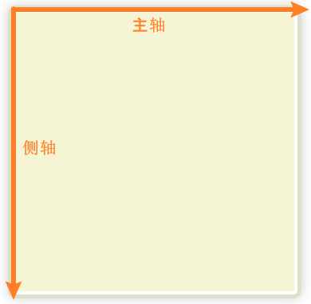 


### 主轴的方向 `flex-direction`

```css
flex-direction: row | row-reverse | column | column-reverse;
```

- `row`（默认值）：主轴为水平向右。
- `row-reverse`：主轴为水平向左。
- `column`：主轴为垂直向下。
- `column-reverse`：主轴为垂直向上。

```html
<div class="flex-container">
    <div class="flex-item">1</div>
    <div class="flex-item">2</div>
    <div class="flex-item">3</div>
</div>
```

**根据上面的结构，依次改变flex-container的`flex-direction`属性结果如下。**

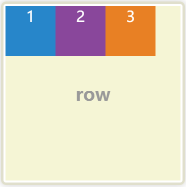 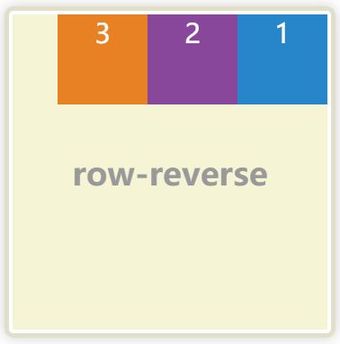 

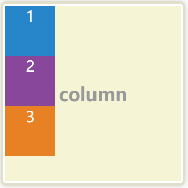 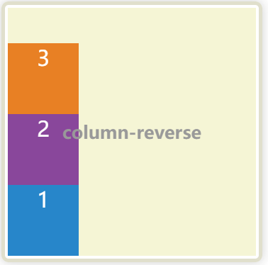 


### 主轴换行`flex-wrap`

```css
flex-wrap: nowrap | wrap | wrap-reverse;
```

- `nowrap`（默认值）：超出不换行，各个元素按规定比例缩小，默认1:1。
- `wrap`：超出换行。
- `wrap-reverse`：超出换行，但颠倒行区块顺序，非直接交换位置。

```html
<div class="flex-container">
    <div class="flex-item">1</div>
    <div class="flex-item">2</div>
    <div class="flex-item">3</div>
    <div class="flex-item">4</div>
</div>
```

**根据上面的结构，依次改变flex-container的`flex-wrap`属性结果如下。**

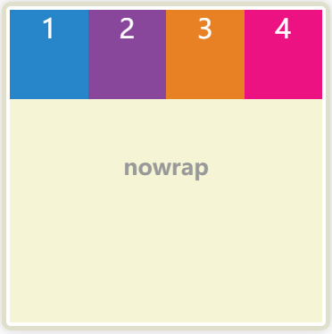 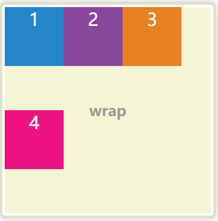 

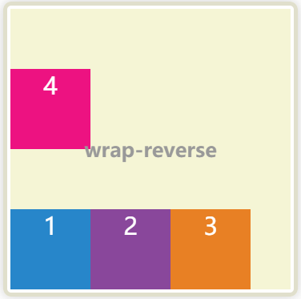 


### 同时设置方向和换行`flex-flow`

```css
flex-flow: <flex-direction> || <flex-wrap>;
```


### 主轴布局`justify-content`

```css
justify-content: flex-start | flex-end | center | space-between | space-around;
```

- `flex-start`（默认值）：起始对齐，如：flex-direction: row 方向从左到右，就是左对齐。
- `flex-end`：末端对齐：如：flex-direction: row 方向从左到右，就是右对齐。
- `center`： 居中
- `space-between`：两端对齐，项目之间的间隔都相等。
- `space-around`：每个项目两侧的间隔相等。

```html
<div class="flex-container">
    <div class="flex-item">1</div>
    <div class="flex-item">2</div>
    <div class="flex-item">3</div>
</div>
```

**根据上面的结构，依次改变flex-container的`justify-content`属性结果如下**

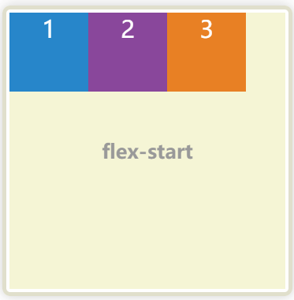  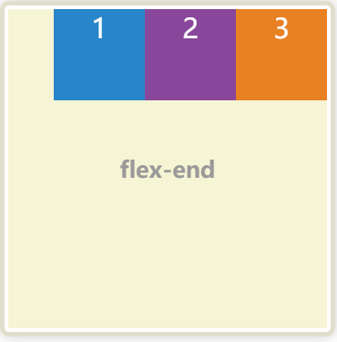  

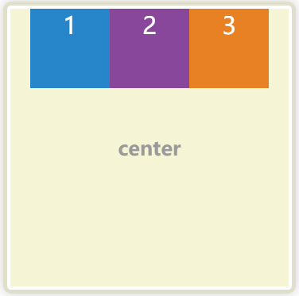 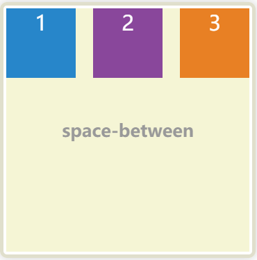 

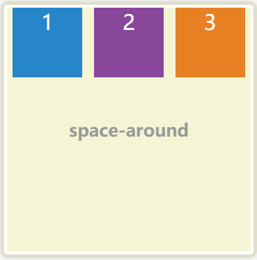 


### 侧轴(与主轴垂直交叉的轴)布局`align-items`

```css
align-items: stretch | flex-start | flex-end | center | baseline;
```

- `stretch`（默认值）：如果项目未设置高度或设为auto，将占满整个容器的高度。
- `flex-start`：交叉轴的起始对齐。
- `flex-end`：交叉轴的末端对齐。
- `center`：交叉轴的中点对齐，即居中。
- `baseline`: 项目的第一行文字的基线对齐。

```css
<div class="flex-container">
    <div class="flex-item" style="height: auto;">1</div>
    <div class="flex-item">2</div>
    <div class="flex-item">3</div>
</div>
```

**根据上面的结构，依次改变flex-container的`align-items`属性结果如下**

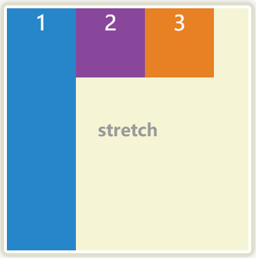 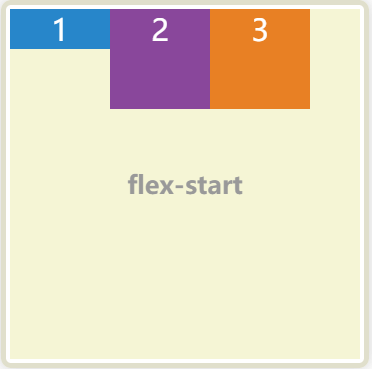 

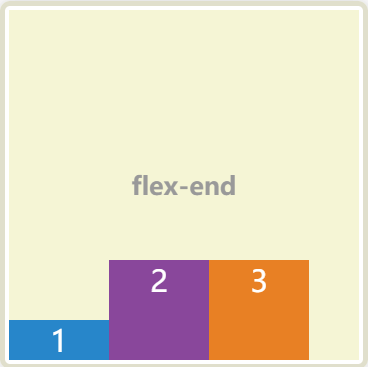 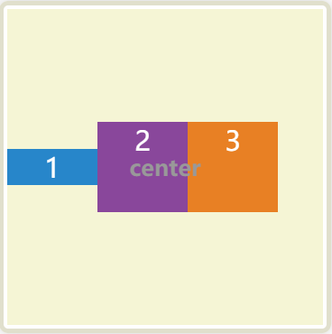 

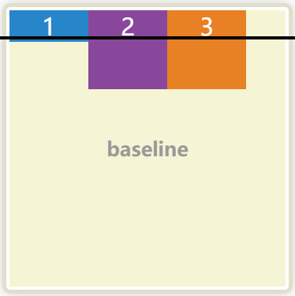 


### 多侧轴布局align-content

**什么叫多轴，不知道你有没有注意到，上面flex-wrap换行，换行自然就多了一行也就多了一条侧轴。**

```css
align-content: stretch | flex-start | flex-end | center | space-between | space-around;
```

- `stretch`（默认值）：轴线占满整个交叉轴。
- `flex-start`：与交叉轴的起点对齐。
- `flex-end`：与交叉轴的终点对齐。
- `center`：与交叉轴的中点对齐。
- `space-between`：与交叉轴两端对齐，轴线之间的间隔平均分布。
- `space-around`：每根轴线两侧的间隔都相等。所以，轴线之间的间隔比轴线与边框的间隔大一倍。

```html
<div class="flex-container">
    <div class="flex-item" style="height: auto;">1</div>
    <div class="flex-item" style="height: auto;">2</div>
    <div class="flex-item" style="height: auto;">3</div>
    <div class="flex-item" style="height: auto;">4</div>
</div>
```

**根据上面的结构，依次改变flex-container的`align-content`属性结果如下**

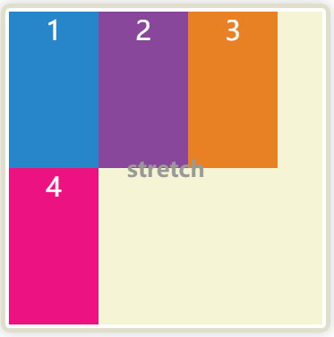 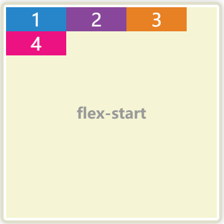 

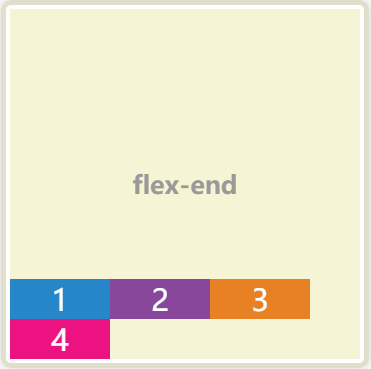 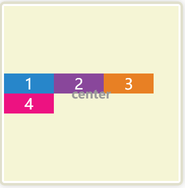 

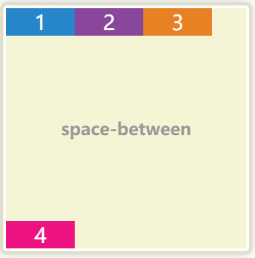 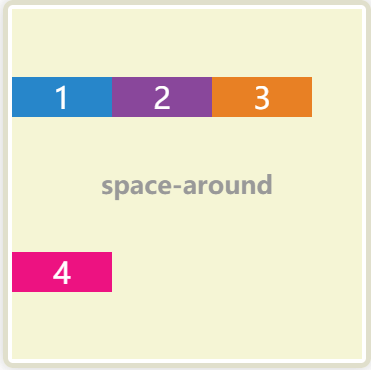 


### 轴上元素单独定义布局`align-self`

```css
align-self: auto | flex-start | flex-end | center | baseline | stretch;
```

**`align-self` 与 `align-items`的效果一样，定义后可以不随`align-items`，单独设置某个元素侧轴布局。**


### 轴上元素定义顺序`order`

```css
order: <integer>;
```

**`order`定义了一个整数，order越大越靠后，越小越接近轴的起始为位置。`order`相同时由html定义顺序决定。**


### 轴上元素其余属性

**除了主要的布局相关元素外，flex也提供了一些缩放属性，用于空间多余，不足等情况下缩放元素。**

**这里只作简单介绍，具体可以查看结尾的更多**

`flex-basis`属性定义了在分配多余空间之前，项目占据的主轴空间（main size）

`flex`属性是`flex-grow`, `flex-shrink` 和 `flex-basis`的简写默认值为`0 1 auto`，决定了元素的基本大小，缩放。

<br>


## 更多

[W3C FLEXBOX SPEC](https://www.w3.org/TR/2018/CR-css-flexbox-1-20181119/)

[MDN 弹性盒子](https://developer.mozilla.org/zh-CN/docs/Learn/CSS/CSS_layout/Flexbox)

[阮一峰 - Flex 布局教程：语法篇](http://www.ruanyifeng.com/blog/2015/07/flex-grammar.html)

[阮一峰 - Flex 布局教程：实例篇](https://www.ruanyifeng.com/blog/2015/07/flex-examples.html)